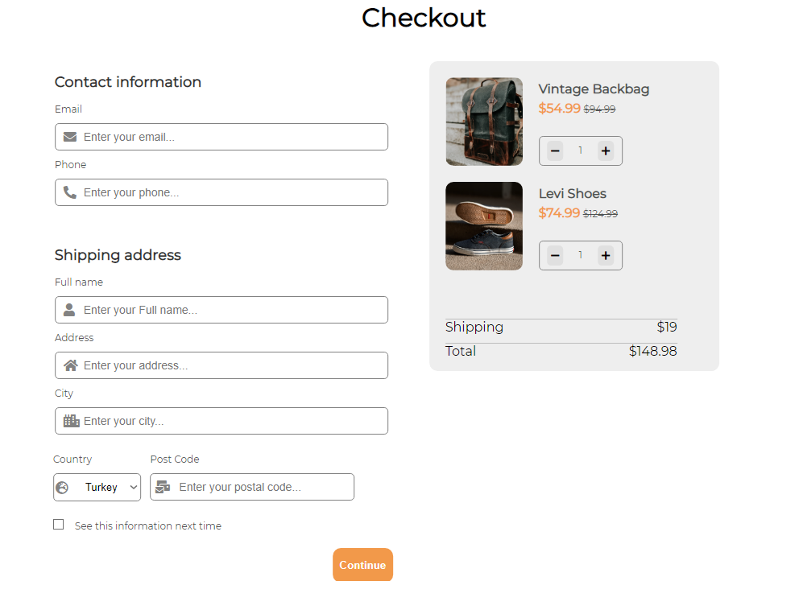

# checkout_page

## Description
Purpose of the this project is to write a code that make a checkout form.

## Expected Outcome

## Objective

Build a responsive web page 

### Following topics are to be covered;

- HTML 

- CSS

- SCSS

<button><a href="https://muratbzc.github.io/checkout_page/">Go To Web Site</a></button>
